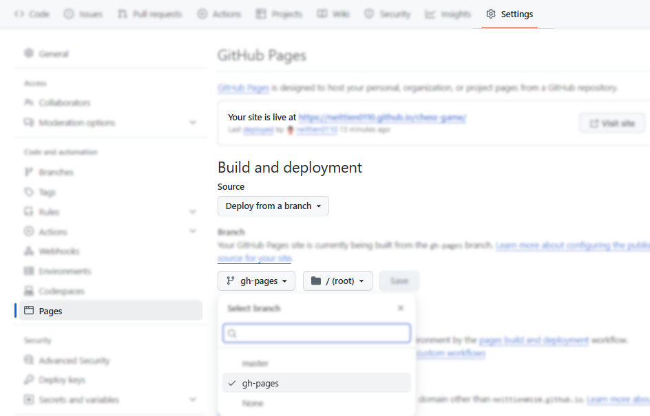

# SERIAL COMMANDER

Chương trình giao tiếp và gửi lệnh tới các thiết bị qua giao tiếp UART, Bluetooth trên nền web, có thể tùy biến theo ý muốn của người dùng và chia sẻ với cộng đồng

Website chính thức: <http://toolhub.app/serialcommander>

## DÀNH CHO DEV

### CD trên GitHub

Chương trình sử dụng thêm gói __gh-pages__ để triển khai sản phẩm trên github cho nhanh. Không liên quan tới sản phẩm. \

Cụ thể thêm __gồm 4 thao tác cài đặt:__

1. Cài đặt gói __gh-pages__ để giúp deploy lên GitHub Pages

   ```shell
      npm install gh-pages --save-dev
   ```

2. Thêm các dòng sau vào file __package.json__

    ```json
    {
        "homepage": "https://<your-username>.github.io/<your-repo-name>",
        "scripts": {
            "deploy": "gh-pages -d dist"
        }
    }
    ```

    > __gh-pages__ cần trỏ tới thư mục sau biên dịch thường là __build__ hoặc __dist__. Cần sửa thiết lập này cho phù hợp với từng dự án.

3. Nếu chưa có branch __gh-pages__, hãy tạo mới. Bỏ qua bước này nếu đã có.

4. Trên tài khoản github, trong Repository dự án, vào __Settings / Pages__, thiết lập __Homepage__ 

5. Vẫn ở giao diện __Pages__, lựa chọn __branch gh-pages__ chứa thành phẩm để deploy.\


Tiếp theo, mỗi lần cần __deploy sản phẩm trên github, chỉ cần thực hiện 1 lệnh__:

```shell
    npm run deploy
```

Đợi vài giây và truy cập lại vào homepage để xem sản phẩm.

## Tham khảo

- [Online Serial Terminal](https://sparkfunx.github.io/WebTerminalDemo/)\
  
- [Giới thiệu các hàm Web Serial API](https://wicg.github.io/serial/)
- [Hướng dẫn chi tiết từ Google Dev kết nối Web API cho giao tiếp Serial, HID, Bluetooth, USB, NFC ](https://developer.chrome.com/docs/capabilities/serial?hl=vi)
- [Cửa sổ debug với các thiết bị ngoại vi kết nối với Google Chrome](about://device-log)\
  

## TÁC GIẢ

Xin gửi lời cảm ơn tới các thành viên đã cùng thực hiện và hoàn thành sản phẩm qua các giai đoạn, bao gồm
[Nguyễn Đức Hà](https://github.com/hadimsctn/FootKeyboard), [Nguyễn Hữu Duy](https://github.com/DuyNH215015/fe-datn)
